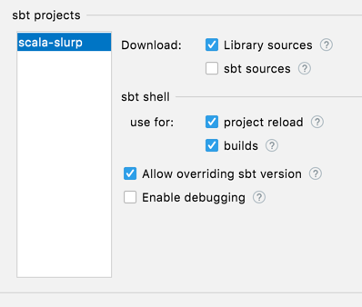
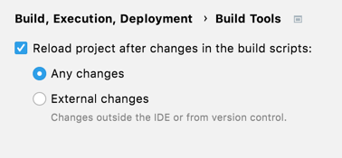

# Scala Slurp
This exercises uses the [Kaggle Pokemon Dataset](https://www.kaggle.com/rounakbanik/pokemon)

## Quickstart
1. In IntelliJ, open this project by selecting the [build.sbt](build.sbt) file.
2. Set up sbt: 
3. Enable auto-reload: 

## Instructions
The goal of this exercise is to ingest some locally stored Pokemon data [src/main/resources/pokemon.csv](src/main/resources/pokemon.csv), filter for `legendary` and `non-legendary` Pokemon, and write both of those to a private S3 bucket (which you also must create). Additionally, you will need to give a friend access to this bucket via an IAM Role.

1. **Ingest data.** In order to start handling our data, we must first ingest it. Assume the data exists at [src/main/resources/pokemon.csv](src/main/resources/pokemon.csv). Handle the relevant delimiters for the `csv` format and don't worry about defining a schema. Update the production code in [src/main/scala/Ingester.scala](src/main/scala/Ingester.scala) and make sure the tests pass at [src/test/scala/IngesterTest.scala](src/test/scala/IngesterTest.scala). Update [src/main/scala/Main.scala](src/main/scala/Main.scala) with the new method. Click the run button to run it E2E.
2. **Transform data.** We want to create two dataframes from your ingested data, that at the end of the day get written to S3 as two separate delta tables. The first dataframe is the set of `legendary` Pokemon and the second dataframe is the set of `non-legendary` Pokemon (check out the [Kaggle Pokemon Dataset](https://www.kaggle.com/rounakbanik/pokemon) for the full schema). Update the production code in [src/main/scala/DataTransformer.scala](src/main/scala/DataTransformer.scala) and make sure the tests pass at [src/test/scala/DataTransformerTest.scala](src/test/scala/DataTransformerTest.scala). Update [src/main/scala/Main.scala](src/main/scala/Main.scala) with the new method. Click the run button to run it E2E.
3. **Write data to S3.** There is already a method in [src/main/scala/DataTransformer.scala](src/main/scala/DataTransformer.scala) that you can use to write each of your `legendary` and `nonLegendary` dataframes to S3 as a delta lake. Update [src/main/scala/Main.scala](src/main/scala/Main.scala) with the new method. Click the run button to run it E2E.
4. **Uh oh, write to WHERE?** In order for us to write to S3, we must create a bucket. Update the production code in [src/main/scala/S3BucketCreator.scala](src/main/scala/S3BucketCreator.scala) and make sure the tests pass at [src/test/scala/S3BucketCreatorTest.scala](src/test/scala/S3BucketCreatorTest.scala). Update [src/main/scala/Main.scala](src/main/scala/Main.scala) with the new method. Click the run button to run it E2E to see if you can write to your S3 bucket. You can also check the AWS console to see if your S3 bucket is present.
5. **Give your colleague access** Your colleague wants the data views that you created in the delta lake format. Assume that your colleague has access to AWS already but has zero permissions to do anything. Create a role which your colleague's AWS IAM User can assume and read the files in the bucket that you created by updating [src/main/scala/AccessorCreator.scala](src/main/scala/AccessorCreator.scala) and ensuring that the tests at [src/test/scala/AccessorCreatorTest.scala](src/test/scala/AccessorCreatorTest.scala) pass. Update [src/main/scala/Main.scala](src/main/scala/Main.scala) with the new method. Click the run button to run it E2E to see if you can write to your S3 bucket. Ask your friend to log into AWS with their credentials and pull the data once you're done.
